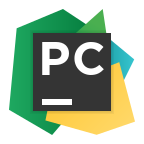
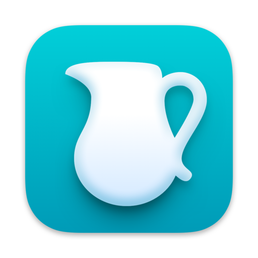

# 🛠 Tools and Technologies:

### 🖥 Development:

  
  
  
  

### 📊 Testing Tools:

  
  
  
  
  

### 💾 Databases:

  
  

### 🔧 Development Environments:

  
  
  

---

## 🚀 AutoTests:

  
  

