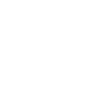
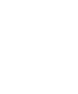
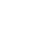
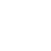

# Привет! 👋

Я — QA-инженер с опытом работы в геодезии и тестировании программного обеспечения. Постоянно развиваюсь в IT, изучая новые инструменты и технологии.

---

## Свяжитесь со мной:

  
  

---

## Инструменты и технологии

  
  
  
  
  
  
  
  
  

---

## Сертификаты

- [Программирование на Python](https://stepik.org/cert/2506692?lang=en)
- [Тестирование ПО: Postman для API тестирования](https://stepik.org/cert/2213124?lang=en)

---

## Описание

В моем профиле вы найдете репозитории с тестовыми проектами, автоматизацией и примерами работы с инструментами.
