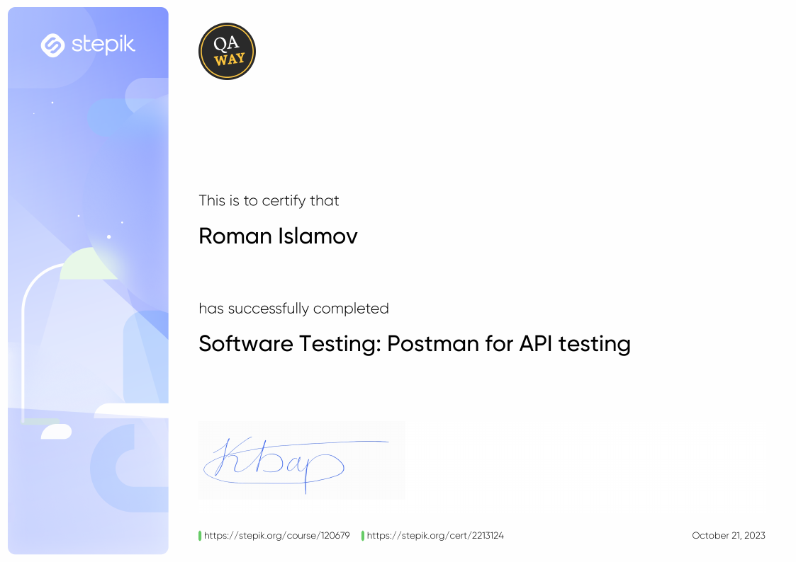
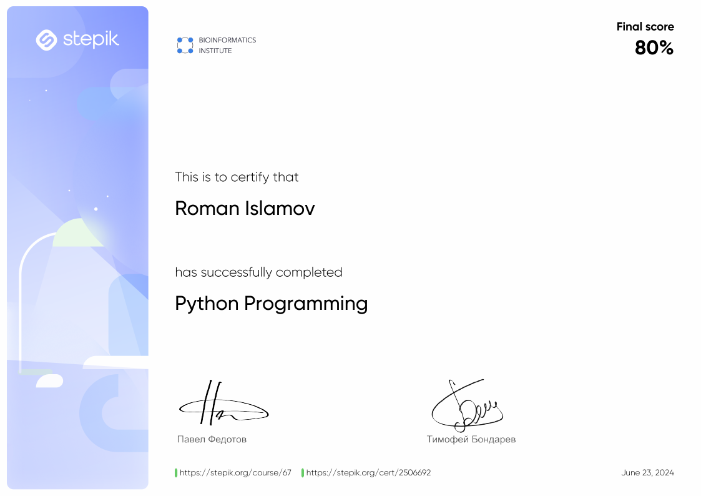
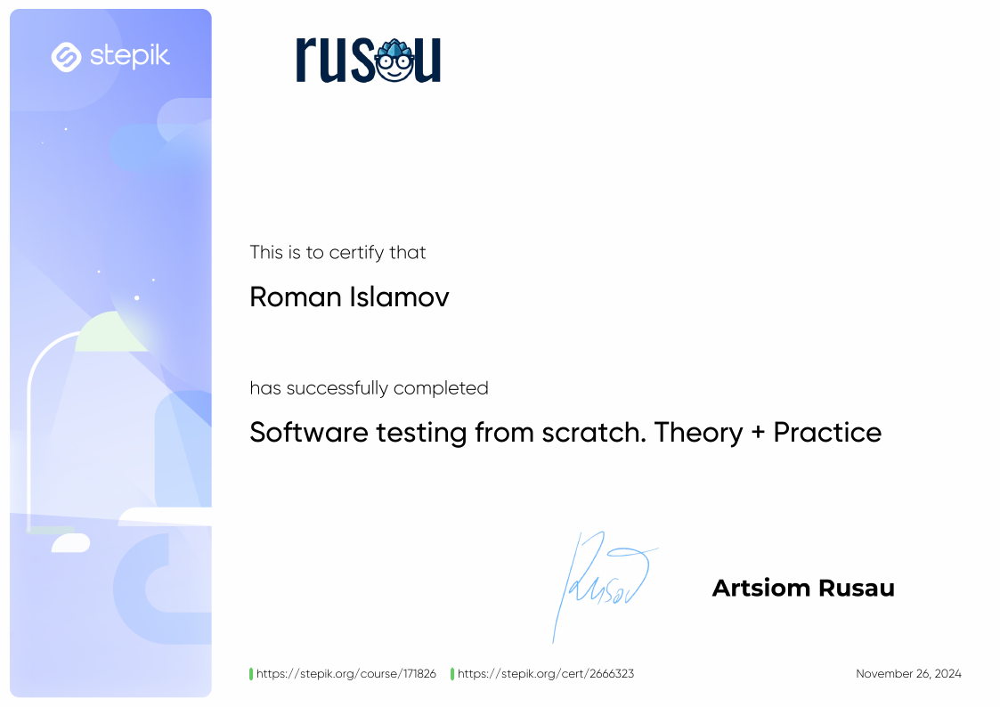

# Hello World

## 👨‍💻 About Me:
I am Roman Islamov, currently working as a Quality Engineer in construction, and actively developing in QA Software and QA Automation.  
On my page, you will find examples of automated tests written in Python + Selenium, as well as other useful resources for beginners and experienced testers.  

---

## 📞 Contact Me:

  
  
  

---

## 🚀 Tools and Technologies:

### 📁 Test Documentation:

  
  
  
  

### 🛠 Web Application Testing:

  
  
  
  
  

### 📱 Mobile Application Testing:

  
  
  
  

### 💾 Data Handling:

  
  

### ✏️ Coding:

  
  
  

---

## 🎓 Certifications:

  
  
  

