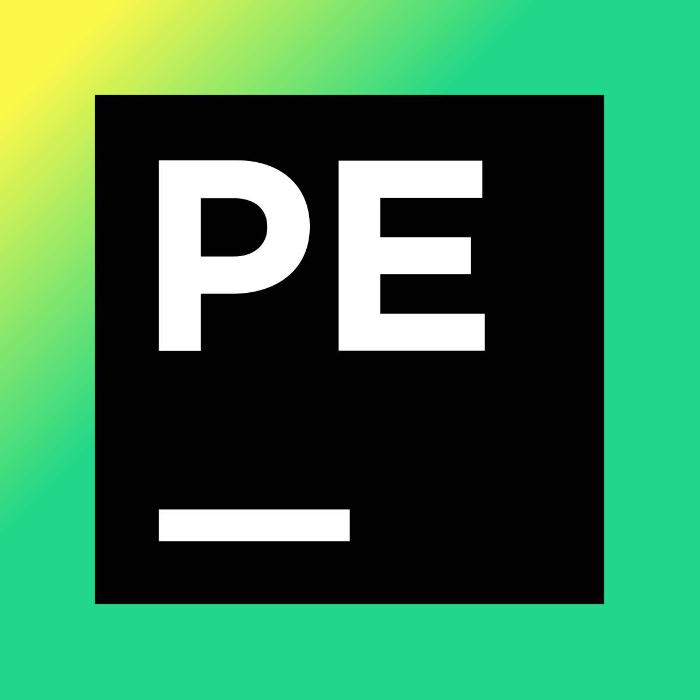

Hi! 👋

I am a QA Engineer with experience in software testing and geodesy. I’m continuously developing my skills in IT, exploring new technologies, and working on test automation.

---

🌟 Connect with me:

---

📋 Tools and Categories:

📝 Test Documentation:

  
  
  
  

---

🌐 Web Application Testing:

  
  
  

---

📱 Mobile Application Testing:

  
  
  

---

🗄️ Data Management:

  
  

---

🛠️ Coding Tools:

  
  

---

📂 Repositories:

DemoQA Automated Tests

API Testing with Postman

---

Feel free to let me know if you want any further refinements!

